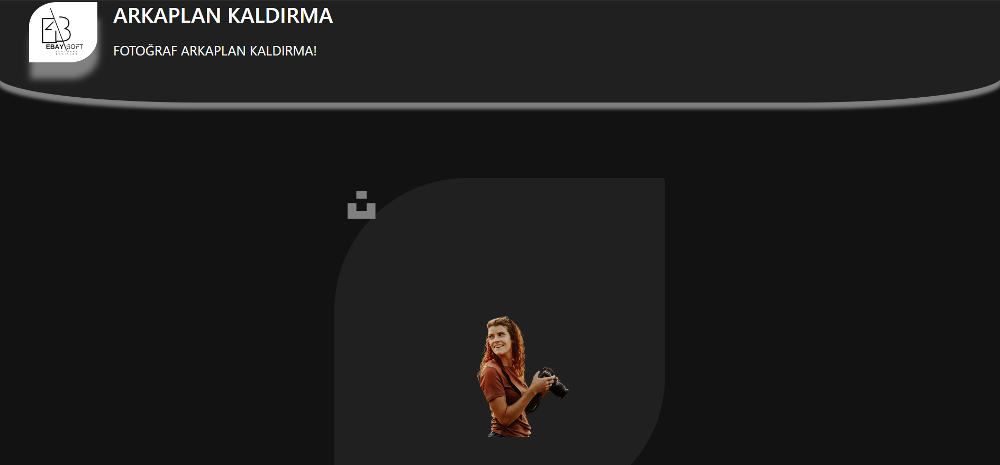

# ***ARKAPLAN KALDIRMA***

  

<b>-> Tüm fotoğraflarınız için arkaplan kaldırma uygulaması</b>
  

-> Bu proje NODEJS ile yapılmıştır!

-> Uygulama ana sayfasında fotoğraf seç butonuyla yüklemek istediğiniz fotoğrafı seçin. 
-> Fotoğrafı yükle butonuna bastığınızda fotoğrafınızın arkaplanı silinip tekrar ekrana gelecektir!

   

    

 
 
  

    <b><strong>Orjinal fotoğraf ve arkaplansız fotoğraf karşılaştırması</strong></b>  
       
    
    

  
 
 

    
      
    

